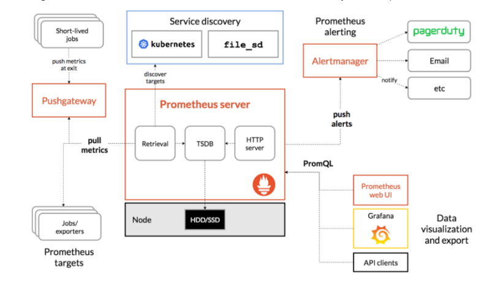

# Monitoring using Prometheus and Grafana on AWS EC2

## Agenda

    Prometheus Architecture (Already deployed on EC2 node [binary | docker-compose] Or On K8S)
    Install Node Exporter on other EC2 Instances
    Configure Prometheus.yml for the EC2 Instances
    EC2 Service Discovery for Prometheus
    Configure Grafana for EC2 Nodes (node_exporter)

## Prerequisite:

    Prometheus EC2 instance t2.micro with [binary | docker-compose] (Already done)
    # OR
    Prometheus On K8s with custom manifests (self managed)
    Node EC2 instances to monitor
    Security Groups Configured properly
    Clone this git repo 

## Security Groups Configured on EC2 Instances

Port 9090 — Prometheus Server on EC2 Or On K8S

Port 9100 — Prometheus Node Exporter On All EC2 Nodes

Port 3000 — Grafana on Prometheus EC2 Or on K8S

## Prometheus K8S Instance ( minikube driver=none )

Configure the security group on EC2 Instance / K8S where Prometheus Server is installed. Allow Port 9090 only to the IP (Office IP) which is administring server.

## Node EC2 Instances

Configure the security group on EC2 Instance which you want to monitor and where you will install Node Exporter as shown below:

One entry is from your IP (Office IP) and one entry is the IP of the EC2 instance Or IP of K8S where Prometheus server is installed so that Prometheus server can read the metrics which is exposed on the Node server.

## Prometheus Architecture

-    Prometheus is an open source tool for monitoring and alerting applications
-    a multi-dimensional data model with time series data identified by metric name and key/value pairs
-    Uses PromQL ( Prometheus Query Language)
-    time series collection happens via a pull model over HTTP
-    Targets System which you want to monitor can be identified using Service Discovery or by static configuration in the yaml file

Below is the diagram of Prometheus architecture and its components


-    Prometheus Server: This component is the central component that collects the metrics from multiple nodes. Prometheus uses the concept of scraping, where target systems’ metric endpoints are contacted to fetch data at regular intervals.
-    Node Exporter: This is called a monitoring agent which we installed on all the target machines so that Prometheus can fetch the data from all the metrics endpoints
-    Push Gateway: Push Gateway is used for scraping metrics from applications and passing on the data to Prometheus. Push Gateway captures the data and then transforms it into the Prometheus data format before pushing.
-    Alert Manager: Alert Manager is used to send the various alerts based upon the metrics data collected in Prometheus.
-    Web UI: The web UI layer of Prometheus provides the end user with an interface to visualize data collected by Prometheus. In this, we will use Grafana to visualize the data.

- If you are not able to access it (Web UI) then make sure your security group is configured for port 9090 and its open for your admin location IP.

## AWS IAM settings
```
Create AWS IAM user service_grafana and add the policy EC2ReadyOnlyAccess
```

## API keys for IAM User
```
Create IAM user API key which has EC2ReadyOnlyAccess. If there is no user available then you can create one and add the policy EC2ReadyOnlyAccess
```

# Prometheus Service Discovery for AWS EC2
Specify the AWS region and use IAM user API key which has EC2ReadyOnlyAccess undder job_name
```  
global:
  scrape_interval: 15s
  external_labels:
    monitor: 'prometheus'

scrape_configs:
  - job_name: 'node'
    ec2_sd_configs:
      - region: us-east-2
        access_key: yourkey
        secret_key: yourkey
        port: 9100
```

## Prometheus Service Discovery with relabeling (Privete IPs)

```  
global:
  scrape_interval: 15s
  external_labels:
    monitor: 'prometheus'

scrape_configs:
  - job_name: 'ec2-node'
    ec2_sd_configs:
      - region: us-east-1
        access_key: yourkey
        secret_key: yourkey
        port: 9100
    relabel_configs:
      - source_labels: [__meta_ec2_public_ip]
        regex: '(.*)' #default value
        target_label: _address_
        replacement: '${1}:9100'
        # action: keep
        # Use the instance ID as the instance label
      - source_labels: [__meta_ec2_tag_Name]
        target_label: instance
```

## Service Discovery with Public IPs
```
  - job_name: 'ec2-node'
    ec2_sd_configs:
      - region: us-west-2
        access_key: ACCESS-KEY
        secret_key: SEC-KEY
        port: 9100
    relabel_configs:
        - source_labels: [__meta_ec2_tag_Name]
          target_label: instance
        - source_labels: [__meta_ec2_public_ip]
          replacement: ${1}:9100
          target_label: __address__

```


## Restart prometheus service
```
sudo systemctl restart prometheus
sudo systemctl status prometheus
```
# Install node_exporter script and service on EC2 nodes

## node_exporter service file
- vi /tmp/node-exporter.service
```
[Unit]
Description=Prometheus Node Exporter Service
After=network.target

[Service]
User=node_exporter
Group=node_exporter
Type=simple
ExecStart=/usr/local/bin/node_exporter

[Install]
WantedBy=multi-user.target
```

- instaall-node_exporter.sh
```
sudo useradd --no-create-home node_exporter

wget https://github.com/prometheus/node_exporter/releases/download/v1.3.1/node_exporter-1.3.1.linux-amd64.tar.gz

tar xzf node_exporter-1.3.1.linux-amd64.tar.gz
sudo cp node_exporter-1.3.1.linux-amd64/node_exporter /usr/local/bin/node_exporter
rm -rf node_node_exporter-1.3.1.linux-amd64.tar.gz node_exporter-1.3.1.linux-amd64

sudo cp /tmp/node-exporter.service /etc/systemd/system/node-exporter.service

sudo systemctl daemon-reload
sudo systemctl enable node-exporter
sudo systemctl start node-exporter
sudo systemctl status node-exporter
```
- Make sure port **9100** is open from your IP to access this url. You should be able to access all the metrics which is coming from this server.

# Grafana Dashboard
```
Dashboard ID = 1860
```

# EC2 Relabelling
- https://www.robustperception.io/automatically-monitoring-ec2-instances

```
global:
  scrape_interval: 1s
  evaluation_interval: 1s

scrape_configs:
  - job_name: 'node'
    ec2_sd_configs:
      - region: eu-west-1
        access_key: PUT_THE_ACCESS_KEY_HERE
        secret_key: PUT_THE_SECRET_KEY_HERE
        port: 9100
    relabel_configs:
        # Only monitor instances with a Name starting with "SD Demo"
      - source_labels: [__meta_ec2_tag_Name]
        regex: SD Demo.*
        action: keep
        # Use the instance ID as the instance label
      - source_labels: [__meta_ec2_instance_id]
        target_label: instance
```

## And edited the prometheus.yml to scrape using public ip instead of private ip.
```
- job_name: 'test-ec2-sd'
  relabel_configs:
      - source_labels: [__meta_ec2_tag_Name]
        target_label: instance
      - source_labels: [__meta_ec2_public_ip]
        replacement: ${1}:9100
        target_label: __address__
```

- https://kbild.ch/blog/2019-02-18-awsprometheus/

```
 - job_name: 'node'
    ec2_sd_configs:
      - region: YOURREGION
        access_key: YOURACCESSKEY
        secret_key: YOURSECRETKEY
        port: 9100
        refresh_interval: 1m
    relabel_configs:
      - source_labels:
        - '__meta_ec2_tag_Name'
        target_label: 'instance'
      - source_labels:
        - '__meta_ec2_tag_customer'
        target_label:  'customer'
      - source_labels:
        - '__meta_ec2_tag_role'
        target_label:  'role'
```

